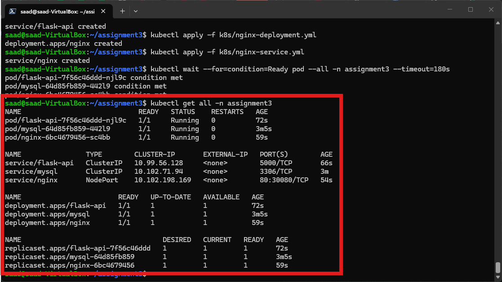
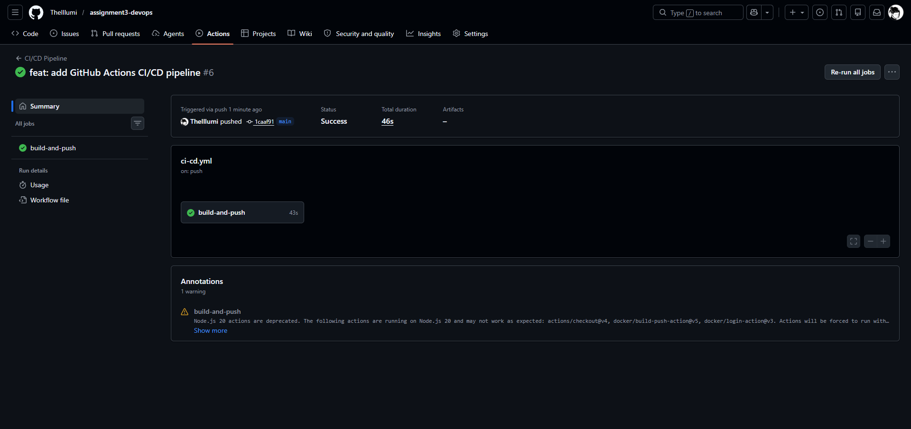

# devops-k8s-3tier-app

[](https://github.com/sedmugen/devops-k8s-3tier-app/actions/workflows/ci-cd.yml)
[](https://opensource.org/licenses/MIT)
[](https://www.docker.com/)
[](https://kubernetes.io/)
[](https://www.python.org/)

> A production-grade, multi-container 3-tier microservices application stack containerized with Docker, automated via GitHub Actions CI/CD, and orchestrated on Kubernetes using Minikube.

---

## 📸 Architecture & Live Demonstration

### System Architecture Diagram


### Key Deployment & Pipeline Highlights

| Kubernetes Deployment Status | GitHub Actions CI/CD Success |
| :---: | :---: |
|  |  |

| End-to-End API Verification | K8s Data Persistence Proof |
| :---: | :---: |
|  |  |

---

## 🎯 Overview & Motivation

Modern cloud applications require robust microservice separation, automated continuous integration, resilient container orchestration, and self-healing storage solutions. 

**devops-k8s-3tier-app** demonstrates end-to-end DevOps practices by implementing a 3-tier architecture:
- **Presentation Layer:** Nginx reverse proxy handling HTTP traffic routing and security header enforcement.
- **Application Layer:** Flask REST API running under a multi-worker **Gunicorn** WSGI server with MySQL connection pooling.
- **Data Layer:** MySQL 8.0 relational database with persistent storage volume claims.

This repository serves as a flagship portfolio piece showcasing real-world cloud engineering, Docker containerization, Kubernetes manifest design, and automated pipeline execution.

---

## ✨ Features

- 🚀 **RESTful Microservices Backend:** Clean REST API offering `/health` status monitoring and complete item CRUD endpoints.
- ⚡ **Production-Ready WSGI & Connection Pooling:** Powered by Gunicorn WSGI server and thread-safe MySQL connection pooling to prevent connection starvation.
- 🛡️ **Container Security & Isolation:** Non-root container execution (`appuser` UID 10001), security response headers in Nginx (`X-Frame-Options`, `X-Content-Type-Options`), and Kubernetes network isolation.
- 📦 **Docker Compose Local Development:** One-command multi-container local startup with healthchecks and automatic container dependencies.
- ☸️ **Kubernetes Minikube Deployment:** Declarative K8s manifests specifying `Namespace`, `ConfigMaps`, `Secrets`, `PV`/`PVC` storage, health probes (`readiness` & `liveness`), resource limits, and service exposing (`NodePort` & `ClusterIP`).
- 🔄 **Automated CI/CD Pipeline:** GitHub Actions workflow executing Pytest automated testing prior to building and pushing Docker images to DockerHub.

---

## 📚 Technical Documentation Directory

| Document | Description |
| :--- | :--- |
| 📖 [**Architecture Specification**](docs/architecture.md) | In-depth technical breakdown of network topology, tiers, security context, and K8s resources. |
| 📜 [**Architectural Decision Records (ADRs)**](docs/decisions.md) | Records of core technical decisions (Nginx proxy, Gunicorn WSGI, MySQL pool, NodePort). |
| 🔌 [**REST API Reference**](docs/api.md) | Full endpoint documentation, request/response schemas, error codes, and cURL examples. |
| 🛠️ [**Setup & Installation Guide**](docs/setup.md) | Detailed installation steps for Docker Compose local dev and Minikube K8s setup. |
| ⚙️ [**Usage & Operations Guide**](docs/usage.md) | Operational workflows, cluster scaling commands, logging streams, and troubleshooting. |
| 💻 [**Development & Testing Guide**](docs/development.md) | Guidelines for local Python virtualenvs, running Pytest suites, and container builds. |

---

## 🛠️ Tech Stack

- **Backend:** Python 3.11, Flask 3.0, Gunicorn 21.2
- **Database:** MySQL 8.0, `mysql-connector-python` 8.2
- **Reverse Proxy:** Nginx (Alpine)
- **Containerization:** Docker, Docker Compose
- **Orchestration:** Kubernetes (Minikube), `kubectl`
- **Automation & Testing:** Bash, Pytest, GitHub Actions

---

## ⚡ Installation & Quickstart

### Prerequisites
- [Docker Engine](https://docs.docker.com/get-docker/) & [Docker Compose](https://docs.docker.com/compose/)
- [Minikube](https://minikube.sigs.k8s.io/docs/start/) & [kubectl](https://kubernetes.io/docs/tasks/tools/)
- [Git](https://git-scm.com/)

### 1. Local Development (Docker Compose)
```bash
git clone https://github.com/sedmugen/devops-k8s-3tier-app.git
cd devops-k8s-3tier-app
cp .env.example .env
docker compose -f app/docker-compose.yml up -d --build
```
Access the application at `http://localhost/health`.

### 2. Kubernetes Cluster Deployment (Minikube)
```bash
chmod +x start.sh
./start.sh
```
*See [docs/setup.md](docs/setup.md) for detailed cluster setup and manifest validation procedures.*

---

## 📖 API Documentation Overview

For full request/response payloads, see [docs/api.md](docs/api.md).

```bash
# Check health
curl -i http://localhost/health

# Create item
curl -i -X POST http://localhost/api/items \
  -H "Content-Type: application/json" \
  -d '{"name": "DevOps Portfolio", "description": "3-Tier Stack on K8s"}'

# List items
curl -i http://localhost/api/items

# Delete item
curl -i -X DELETE http://localhost/api/items/1
```

---

## 🗺️ Roadmap & Testing

- [x] Gunicorn WSGI multi-worker integration
- [x] Thread-safe MySQL connection pooling
- [x] Non-root container security context (`appuser` UID 10001)
- [x] Pytest automated test suite & CI/CD pipeline integration
- [ ] Ingress Controller with TLS cert-manager integration
- [ ] Prometheus & Grafana monitoring dashboards

---

## 📄 License & Credits

This project is licensed under the [MIT License](LICENSE) - see the LICENSE file for details.

Developed & Maintained by **[sedmugen](https://github.com/sedmugen)**.
