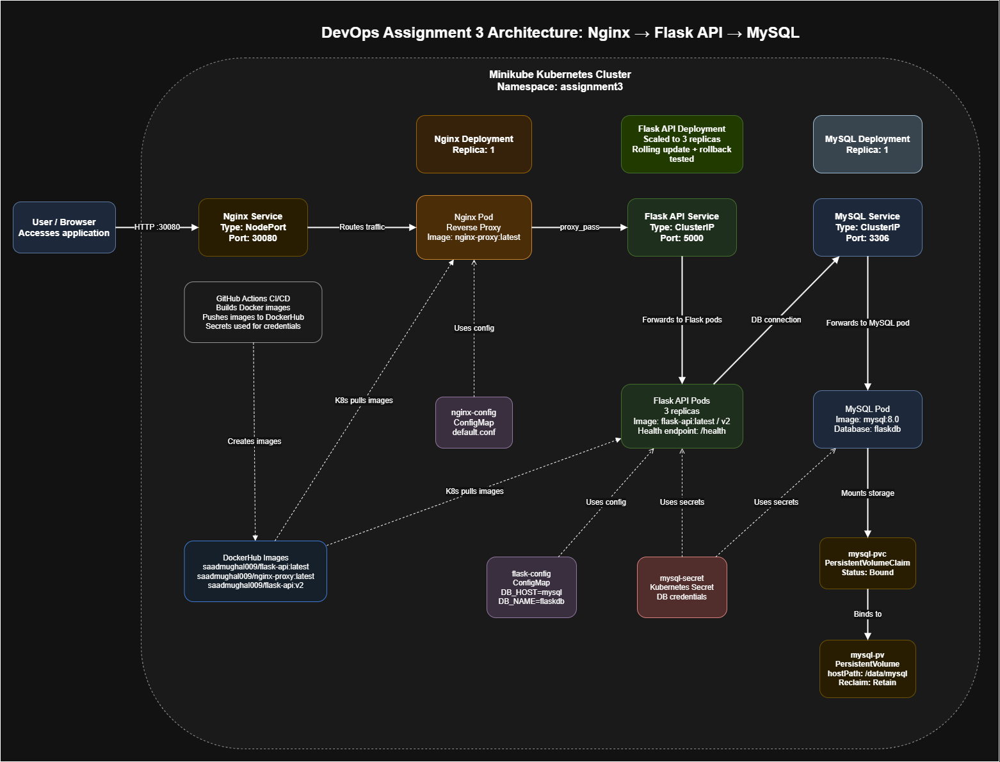

# Architecture & Technical Design

This document details the multi-tier microservices architecture, network topologies, Kubernetes workload design, and storage strategy implemented in **devops-k8s-3tier-app**.

---

## 1. System Overview



The system is structured as a classic 3-tier cloud-native web application:

```
                                [ External Client / Browser ]
                                              │
                                       NodePort: 30080
                                              │
                        ┌─────────────────────▼─────────────────────┐
                        │      Tier 1: Nginx Reverse Proxy           │
                        │       (ClusterIP / NodePort Service)       │
                        └─────────────────────┬─────────────────────┘
                                              │
                                    ClusterIP: 5000 (Internal)
                                              │
                        ┌─────────────────────▼─────────────────────┐
                        │      Tier 2: Flask REST API                │
                        │       (Gunicorn WSGI Application)          │
                        └─────────────────────┬─────────────────────┘
                                              │
                                    ClusterIP: 3306 (Internal)
                                              │
                        ┌─────────────────────▼─────────────────────┐
                        │      Tier 3: MySQL Database                │
                        │       (Persistent Storage Engine)          │
                        └─────────────────────┬─────────────────────┘
                                              │
                                    PersistentVolumeClaim
                                              │
                        ┌─────────────────────▼─────────────────────┐
                        │       PersistentVolume (HostPath / Storage)│
                        └───────────────────────────────────────────┘
```

---

## 2. Tier Breakdown

### Tier 1: Presentation (Nginx Reverse Proxy)
- **Role:** Handles incoming client HTTP connections on port 80 and proxies valid requests upstream to the Flask API layer.
- **Image:** `nginx:alpine` customized with security response headers (`X-Frame-Options`, `X-Content-Type-Options`, `X-XSS-Protection`).
- **Kubernetes Expose:** Exposed externally via a `NodePort` Service mapping port 80 to port `30080` on the Minikube cluster node.

### Tier 2: Application (Flask REST API)
- **Role:** Implements business logic and CRUD operations for `/api/items` and microservice health probing via `/health`.
- **WSGI Runner:** Runs under **Gunicorn** (`gunicorn -w 4 -b 0.0.0.0:5000 app:app`) for high concurrency and production stability.
- **Database Access:** Uses a thread-safe MySQL connection pool (`mysql.connector.pooling.MySQLConnectionPool`) to reuse database connections efficiently.
- **Kubernetes Expose:** Exposed internally within the `assignment3` namespace using a `ClusterIP` Service on port 5000.

### Tier 3: Data (MySQL Database)
- **Role:** Relational database storing application records in the `items` table.
- **Engine:** `mysql:8.0`.
- **Persistence:** Volume storage mapped to `/var/lib/mysql` via a Kubernetes `PersistentVolumeClaim` (PVC) bound to a `PersistentVolume` (PV) of size 1Gi.
- **Kubernetes Expose:** Internal `ClusterIP` Service on port 3306.

---

## 3. Security & Isolation

1. **Namespace Isolation:** All Kubernetes resources run inside a dedicated namespace (`assignment3`).
2. **Network Scoping:** Backend API and MySQL services use `ClusterIP`, ensuring they are strictly unreachable from outside the cluster. Only Nginx is exposed via `NodePort`.
3. **Container Hardening:** Containers run under non-root user contexts (`appuser` UID 10001) to prevent privilege escalation.
4. **Secret Injection:** Database passwords are injected into pods using Kubernetes `Secret` resources (`mysql-secret`).

---

## 4. Health Monitoring & Resilience

- **Flask API Readiness Probe:** `GET /health` with `initialDelaySeconds: 10`, `periodSeconds: 5`.
- **Flask API Liveness Probe:** `GET /health` with `initialDelaySeconds: 30`, `periodSeconds: 10`.
- **Database Startup Probe & Healthcheck:** Automatic connection retries upon application initialization allow Flask to wait for MySQL to complete initialization without crashing.
