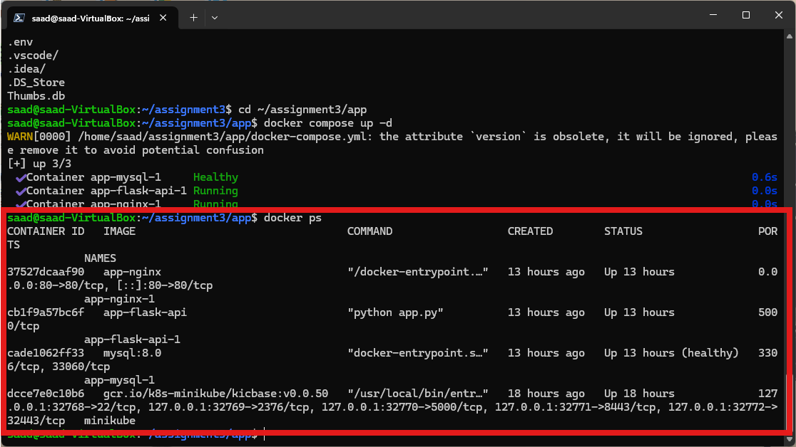

# Setup & Installation Guide

This document provides step-by-step instructions for installing and running **devops-k8s-3tier-app** in both local Docker Compose and Kubernetes (Minikube) environments.

---

## Prerequisites

Before starting, ensure your host environment meets the following software requirements:

| Tool | Recommended Version | Purpose |
| :--- | :--- | :--- |
| **Docker Engine** | `24.0+` | Multi-container runtime |
| **Docker Compose** | `v2.20+` | Local multi-service orchestration |
| **Minikube** | `v1.30+` | Local single-node Kubernetes cluster |
| **kubectl** | `v1.27+` | Kubernetes command-line tool |
| **Git** | `2.40+` | Source code control |
| **Python** *(Optional)* | `3.11+` | Running local test suite directly |

---

## 1. Environment Configuration

1. Clone the repository:
   ```bash
   git clone https://github.com/sedmugen/devops-k8s-3tier-app.git
   cd devops-k8s-3tier-app
   ```

2. Generate local environment file:
   ```bash
   cp .env.example .env
   ```

---

## 2. Option A: Local Development via Docker Compose

Docker Compose provides a fast, multi-container development environment isolated via a dedicated bridge network.

### Start the Stack
```bash
docker compose -f app/docker-compose.yml up -d --build
```

### Inspect Running Services
```bash
docker compose -f app/docker-compose.yml ps
```



### Verify Endpoint Health
```bash
curl -i http://localhost/health
```

### Stop the Stack
```bash
docker compose -f app/docker-compose.yml down -v
```

---

## 3. Option B: Kubernetes Deployment via Minikube

The Kubernetes deployment runs the application in an isolated namespace (`assignment3`) with PersistentVolumes, ConfigMaps, Secrets, and NodePort services.

### One-Command Deployment Script
```bash
chmod +x start.sh
./start.sh
```


### Script Execution Workflow
1. Initializes Minikube with 2 CPUs and 2048MB memory (`--driver=docker`).
2. Applies `k8s/namespace.yml` to create the `assignment3` namespace.
3. Injects secrets (`k8s/mysql-secret.yml`) and configuration maps (`flask-configmap.yml`, `nginx-configmap.yml`).
4. Binds PersistentVolume (`mysql-pv.yml`) and Claim (`mysql-pvc.yml`).
5. Deploys MySQL database and waits for container readiness.
6. Deploys Flask API and Nginx proxy deployments.
7. Displays cluster status and outputs the Minikube NodePort service URL.

---

## 4. Kubernetes Manifest Validation & Cleanup

### Validate Manifest Syntax (Dry Run)
```bash
./start.sh --check
```

### Delete Kubernetes Resources
```bash
./start.sh --clean
```
