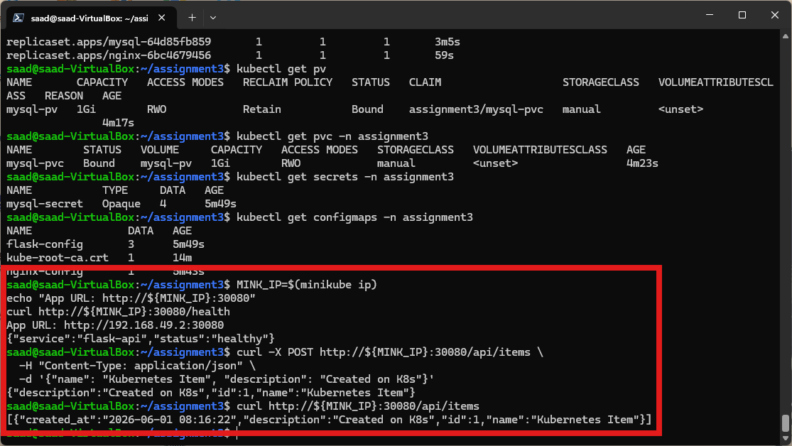
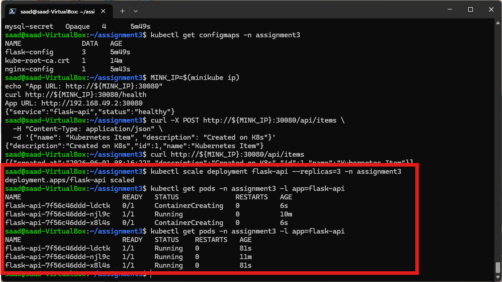
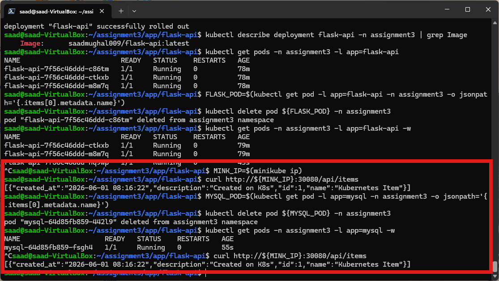
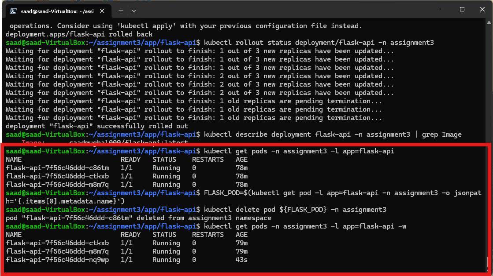

# Usage & Operations Guide

This guide describes API usage patterns, operational workflows, scaling procedures, and debugging techniques for **devops-k8s-3tier-app**.

---

## 1. REST API Operations

### End-to-End API Execution Proof


### Health Check Endpoint
Used by Kubernetes readiness and liveness probes to monitor application availability.

- **Request:**
  ```bash
  curl -i http://localhost/health
  ```
- **Response (200 OK):**
  ```json
  {
    "service": "flask-api",
    "status": "healthy"
  }
  ```

---

### Item Management Endpoints

#### List Items
Retrieves all records ordered by creation timestamp descending.
```bash
curl -i http://localhost/api/items
```

#### Create Item
Inserts a new item record into the database.
```bash
curl -i -X POST http://localhost/api/items \
  -H "Content-Type: application/json" \
  -d '{
    "name": "Production Microservice",
    "description": "Deployed via Minikube"
  }'
```

#### Delete Item
Deletes an existing record by numeric ID.
```bash
curl -i -X DELETE http://localhost/api/items/1
```

---

## 2. Cluster Operations & Scaling

### View Workload Status
```bash
kubectl get all -n assignment3
```

### Scale Flask API Replicas
To scale the stateless backend API tier to handle higher concurrency:
```bash
kubectl scale deployment/flask-api --replicas=3 -n assignment3
```



---

## 3. Storage Persistence & Self-Healing Proof

### Data Persistence Across Pod Restarts
Even if the MySQL pod or node restarts, application data remains intact due to PersistentVolumeClaims (`mysql-pvc`).



### Automatic Kubernetes Self-Healing
Kubernetes automatically restarts failed pods and restores workload readiness.



---

## 4. Troubleshooting & Diagnostics

### Diagnostic Checklist

| Issue | Potential Cause | Solution |
| :--- | :--- | :--- |
| `502 Bad Gateway` | Flask API container not ready | Check `kubectl get pods -n assignment3` and inspect `flask-api` logs. |
| `500 Internal Server Error` | Database connection error | Verify `mysql-secret` credentials and MySQL pod readiness. |
| `PersistentVolumeClaim Pending` | Minikube hostPath storage issue | Run `minikube status` and ensure storage provisioner is running. |
| `ImagePullBackOff` | Invalid image tag or credentials | Verify image tags in `k8s/flask-deployment.yml` match DockerHub repository. |
